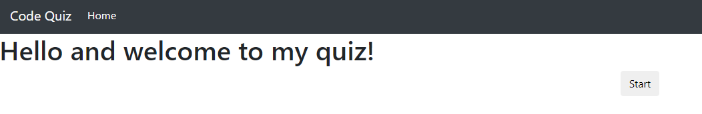
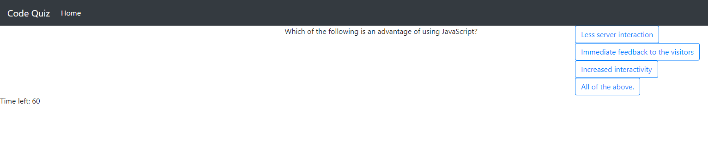
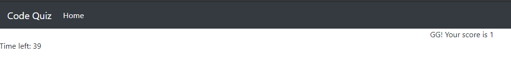

# Javascript Quiz

## Description

https://christian-bryant2020.github.io/Code-Quiz/ is a multiple choice quiz that keeps track of the users current score and displays it in the end. 

## Technology Stack

Frontend
    HTML
    CSS

Backend
    Javascript

## User Interface

Landing Page

The quiz UI

View your score
